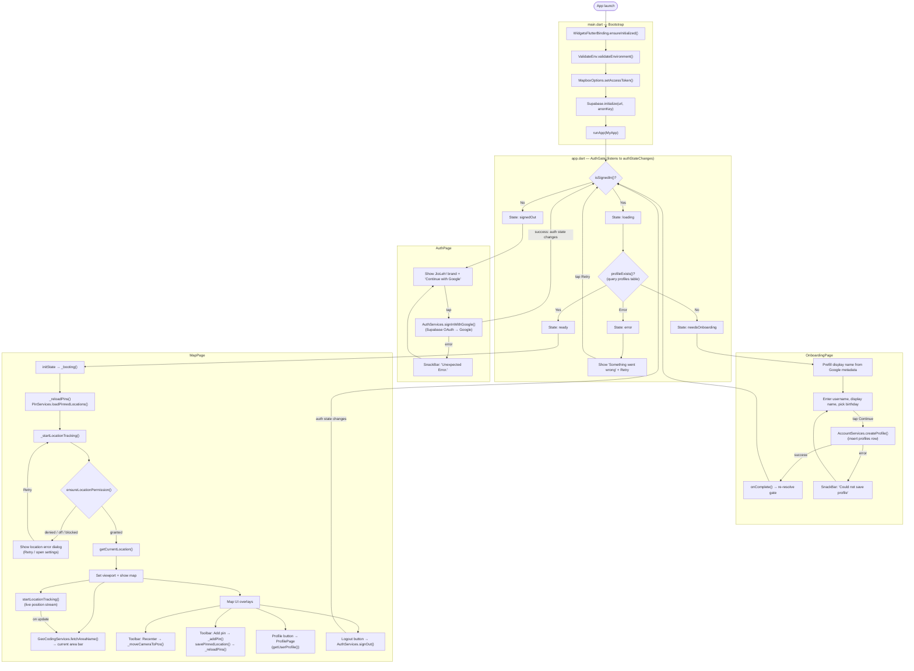

# JioLeh! — App Flowchart

This diagram describes the runtime flow of the current Flutter app: bootstrap,
the auth gate that routes between sign-in / onboarding / map, and the map
experience (location tracking, pins, profile).

## Key components

| Layer | Files |
|---|---|
| Bootstrap | `lib/main.dart`, `lib/config/` |
| Routing / auth gate | `lib/app.dart` |
| Pages | `lib/pages/auth_page.dart`, `onboarding_page.dart`, `map_page.dart`, `profile_page.dart` |
| Services | `lib/services/auth_services.dart`, `account_services.dart`, `pin_services.dart`, `location_services.dart`, `geocoding_services.dart` |
| Backend | Supabase Auth (Google OAuth), Postgres (`profiles`, `pinned_locations`), Mapbox |
